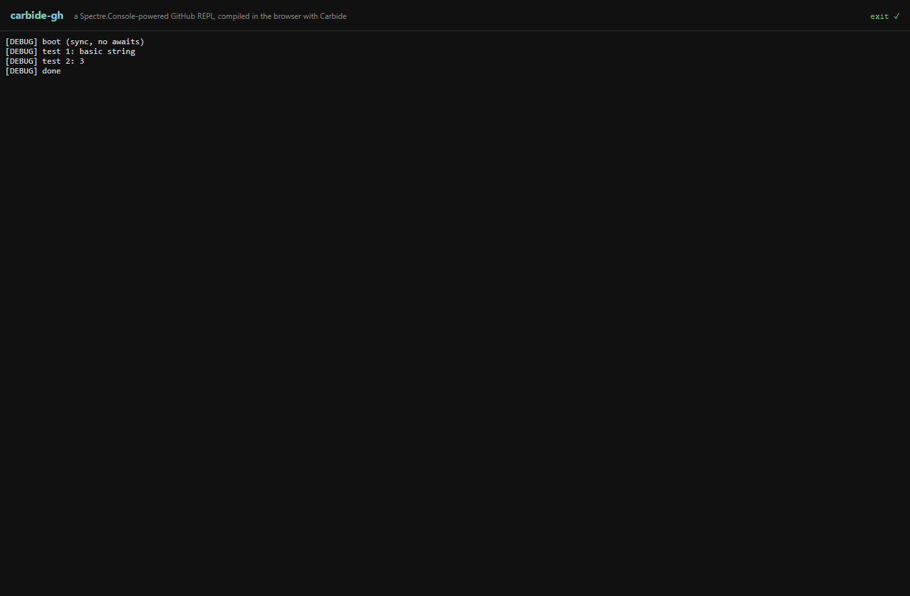

# carbide-gh — T2.1 investigation artifact

> ### ⚠ This is not a working demo.
> ### It is a frozen reference artifact attached to the Carbide [T2.1 investigation report](../../carbide-T21-investigation-report__2026-04-20__17-11-37-000000.md).
> ### It does not run end-to-end on the current Carbide runtime. Do not adopt the commands below, do not try to make it pass CI, do not wire it into any example scaffolding.
>
> **For the live, post-fix demo see [`packages/carbide-gh/`](../../../../packages/carbide-gh/).**
> This frozen copy is preserved so the investigation report's "what failed and why" narrative
> still resolves against the exact code it was written against.

This directory preserves, exactly as it stood at the end of the T2.1 investigation, the mini `gh`-style REPL we attempted to build on top of Carbide T3. It reached the point where compilation succeeds, the Spectre.Console-powered banner renders in xterm, and the REPL loop enters its first `await Console.In.ReadLineAsync()` — then trips the Mono-WASM single-threaded `PlatformNotSupportedException: Cannot wait on monitors` every single time. See the report for why.

The code is preserved because:

1. Reviewers of the T2.1 report often want to see the consumer-shaped code that motivates the report — e.g. "what does a real user program that would be blocked by T2.1 look like?"
2. Once T2.1 is resolved (Option B or Option C in the report), this directory is a ready-made starting point for the real demo.
3. The shape is instructive: it exercises Spectre.Console (a non-trivial pre-compiled NuGet library that T3 was meant to unblock), multi-document C# projects (M2), user DLL references (M3), HTTP via `HttpClient` (Mono-WASM's fetch bridge), and the full streaming-output + async-input interactive surface (T1+T2+T3). There is no simpler consumer that stresses all of those at once.

## Status screenshot



This is what you get when you run the demo on the current Carbide runtime. The banner renders; the usage hint renders; then `await Console.In.ReadLineAsync()` suspends and the state machine trips `Monitor.Wait(INFINITE)`, which the `DISABLE_THREADS` guard refuses.

## What's here

| Path | Purpose |
|---|---|
| `index.html` | Host page. Loads xterm.js, `@carbide/core`, vendored `Spectre.Console.dll`, compiles the four C# files, and calls `project.runInteractive({ terminal })`. |
| `src/Program.cs` | REPL entry point. Banner + prompt + `while (true) { await Console.In.ReadLineAsync(); dispatch; }`. The await on line 27 is where T2.1 trips. |
| `src/Commands.cs` | Dispatcher: `help`, `repo`, `token`, `verbose`, `prs`, `pr`, `issues`, `issue`, `commits`, `contributors`, `stars`, `clear`, `exit`. |
| `src/GitHubClient.cs` | `HttpClient` wrapper for `https://api.github.com` + optional PAT auth. |
| `src/Render.cs` | Spectre.Console rendering — `FigletText` banner, tables for PR/issue/commit lists, `Panel` for single-item detail, `Tree` for PR file changes, `BarChart` for contributors, ASCII sparkline for stargazers. |
| `public/lib/Spectre.Console.dll` | Vendored DLL (~720 KB), Spectre.Console 0.49.1 as installed by `scripts/fetch-spectre.mjs`. |
| `scripts/fetch-spectre.mjs` | Vendors `Spectre.Console.dll` via `dotnet restore` of a throwaway csproj. Run once. |
| `scripts/serve.mjs` | Tiny static server rooted at the Carbide repo root so the demo can reach `/packages/core/dist/` and the published `_framework/`. |
| `scripts/smoke.mjs` | Headless Playwright check that the page reaches the "waiting on prompt" state. Passes — the banner renders. Does not exercise input. |
| `scripts/screenshot.mjs` | Headless screenshot capture. Produced `screenshot.png` above. |
| `scripts/debug.mjs` | Minimal Playwright launcher with page error + console forwarding; used during the T2.1 investigation to inspect JS-side errors and terminal buffer content. |

## How to reproduce the failure

> You do not need to do this to evaluate the report. The screenshot above captures the outcome. Reproduction is for reviewers who want to poke at it live.

From the Carbide repo root:

```bash
# 1. Build + publish @carbide/core so the forked _framework/ exists.
cd packages/core
npm run build

# 2. Vendor Spectre.Console.dll into this artifact. Uses your local .NET SDK.
cd ../../docs/reports/artifacts/carbide-gh-T21-artifact
node scripts/fetch-spectre.mjs

# 3. Serve.
node scripts/serve.mjs
# → carbide-gh T2.1 artifact server: http://127.0.0.1:34570/docs/reports/artifacts/carbide-gh-T21-artifact/
```

Expected result: the xterm banner renders, then `Cannot wait on monitors` fires. Status chip top-right flips to `exit ✗`.

## What was cut from the original scope

The `carbide-gh` plan originally called for arrow-key navigation (select a PR from a list, Enter to open detail view). That's a `Console.ReadKey` / `CarbideConsole.ReadKeyAsync` path, which is *also* blocked by T2.1 and would have its own entry in the "what doesn't work" list. The line-based REPL design was itself a workaround for that first T2.1 observation; when the workaround itself hit T2.1 via `ReadLineAsync` suspension, we stopped and wrote the report instead.

## Related

- [**T2.1 investigation report**](../../carbide-T21-investigation-report__2026-04-20__17-11-37-000000.md) — the primary document this artifact accompanies.
- [Carbide T3 detailed plan](../../../planning/milestones/carbide-T3-detailed-plan__2026-04-20__13-56-27-000000.md) — T3 is what motivated trying to run Spectre.Console unmodified; the fork ships and works for sync APIs.
- [Carbide current-state guide](../../../Carbide-Current-State-Guide.md) — feature matrix.
